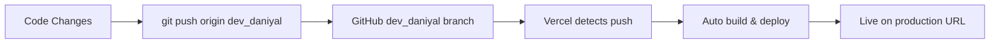

# Vercel Branch Configuration

## ✅ Important: Production Branch is `dev_daniyal`

Your main/production branch is **`dev_daniyal`** (not `main` or `master`).

---

## 🔧 Configure Vercel to Use `dev_daniyal` Branch

### For Backend Project

1. Go to [Vercel Dashboard](https://vercel.com/dashboard)
2. Click on **backend** project
3. Go to **Settings** → **Git**
4. Under **Production Branch**, change from `main` to `dev_daniyal`
5. Click **Save**

### For Admin Panel Project (When Deployed)

1. Go to [Vercel Dashboard](https://vercel.com/dashboard)
2. Click on **sahal-admin-panel** project (when created)
3. Go to **Settings** → **Git**
4. Under **Production Branch**, change from `main` to `dev_daniyal`
5. Click **Save**

---

## 🚀 Automatic Deployments

Once configured, any push to `dev_daniyal` will automatically trigger a deployment:

```bash
git add .
git commit -m "Your changes"
git push origin dev_daniyal
```

Vercel will automatically:
- ✅ Detect the push
- ✅ Build the project
- ✅ Deploy to production
- ✅ Update the live URL

---

## 📋 Current Repository Info

- **GitHub Repo**: https://github.com/DaniyalNaeemRopstam/SahelApp
- **Production Branch**: `dev_daniyal`
- **Backend URL**: https://backend-qbdmvr2wv-daniyals-projects-a2864b3d.vercel.app
- **Latest Commit**: All deployment configurations pushed

---

## ✅ Next Steps

1. **Set Production Branch in Vercel Dashboard**:
   - Backend: Change to `dev_daniyal`
   - Admin Panel: Will set when deploying

2. **Complete MongoDB Setup**:
   - Follow `BACKEND_ENV_SETUP.md`
   - Add environment variables
   - Redeploy backend

3. **Deploy Admin Panel**:
   - Will automatically use correct branch from GitHub

---

## 🔄 How Auto-Deployment Works



Every push to `dev_daniyal` = automatic production deployment! 🎉

